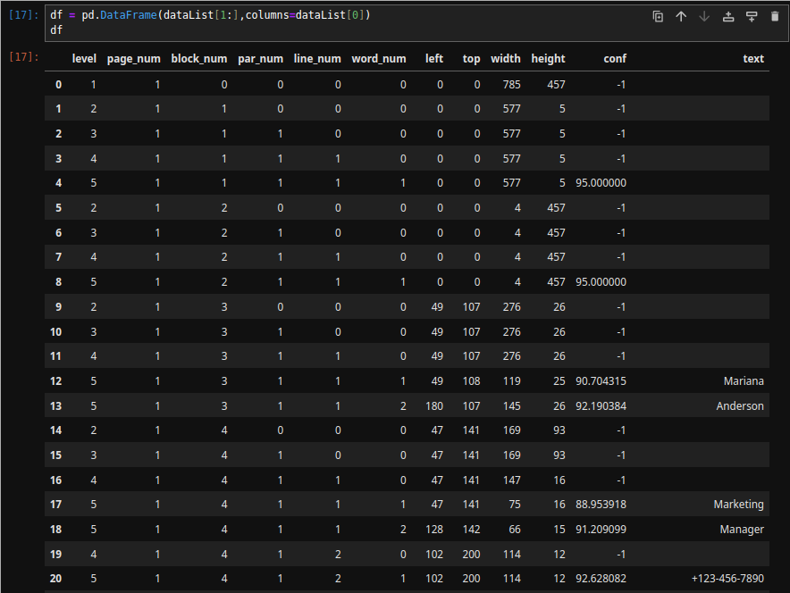

# Text detection

- Tohid Eghdami, Mabahes Vijeh, 25 December 2024

## 1: Install dependencies

In my OS(Manjaro) we can simply run:

```bash
# to install numpy, pandas, scipy, matplotlib, pytesseract, jupyter-notebook and opencv:
yay -S python-numpy python-pandas python-scipy python-matplotlib python-pytesseract jupyter-notebook python-opencv
# to install tesseract and tesseract-data-eng:
sudo pacman -S tesseract tesseract-data-eng
```

## 2: Create project

Create a new folder that named `myApp` and go inside it:

```bash
mkdir myApp
cd myApp
```

## 3: Open jupyter-notebook

After navigate to your project folder, run `jupyter-notebook` and your browser will open a local web app like this (you can change your theme by selecting `Settings > Theme > JupyterLab Dark`):


## 4: Check dependencies

After running jupyter-notebook, in a new `python 3(ipykernel)` run:

```python
import numpy as np
import pandas as pd
import PIL as pl
import cv2 as cv
import pytesseract as ts
```

No errors means everything is ok.

## 5: Collect images

Create new folder `mkdir images` in your root project directory.

Search `templates business cards` and in `images` tab, download a few images in your `yourproject/images/` directory

Just like this:

```txt
.
├── images
│   ├── img-01.png
│   ├── img-02.png
│   ├── img-03.png
│   └── img-04.png
```

### Get all images in python

Import new stuff to get all images and ignore possible warnings:

```python
import os
from glob import glob
from tqdm import tqdm

import warnings
warnings.filterwarnings('ignore')
```

Create a new var and use `glob()` to get all images in `./images` directory:

```python
imgPaths = glob('./images/*.png')
```

To see result u can just add a new cell and write your var name like this:


## 6: Load an image

Run this code to see an image in your jupyter-notebook:

```python
# Pillow
img_pl = pl.Image.open(imgPaths[0])
img_pl
```

And this one to see an image in a new window in your computer (You can press any key to close that new window):

```python
# OpenCV
img_cv = cv.imread(imgPaths[0])
cv.startWindowThread()
cv.imshow('Business Card', img_cv)
cv.waitKey(0)
cv.destroyAllWindows()
```

## 7: Text extraction

### Extract texts

Easily by `ts.image_to_string(img_pl)` you can extract texts of an image:

```python
text_pl = ts.image_to_string(img_pl)
print(text_pl)
```

- result 🤠:

```text
Mariana Anderson

Marketing Manager
+123-456-7890
+123-456-7890

www.reallygreatsite.com
hello@reallygreatsite.com

123 Anywhere St,, Any City, ST
12345

Business
Logo
```

### Extract data

We can extract data of texts(like their content or position or height or ...) by `ts.image_to_data(img_pl)`

But its so unreadable and we can clean up this with a map:

```python
# unreadable data:
data = ts.image_to_data(img_pl)
# clean data:
dataList = list(map(lambda x: x.split('\t'),data.split('\n')))
```

If you want to see result of `dataList` it is something like:

```python
[['level',
  'page_num',
  'block_num',
  'par_num',
  'line_num',
  'word_num',
  'left',
  'top',
  'width',
  'height',
  'conf',

  .
  . (so much lines)
  .

  'Business'],
 ['4', '1', '7', '1', '2', '0', '596', '288', '83', '36', '-1', ''],
 ['5', '1', '7', '1', '2', '1', '596', '288', '83', '36', '91.656006', 'Logo'],
 ['2', '1', '8', '0', '0', '0', '432', '0', '353', '457', '-1', ''],
 ['3', '1', '8', '1', '0', '0', '432', '0', '353', '457', '-1', ''],
 ['4', '1', '8', '1', '1', '0', '432', '0', '353', '457', '-1', ''],
 ['5', '1', '8', '1', '1', '1', '432', '0', '353', '457', '95.000000', ' '],
 ['']]
```

Still unreadable but better than raw data

#### make it readable

Simply by using `pd.DataFrame(dataList[1:],columns=dataList[0])` we can see a better view of our data:

```python
df = pd.DataFrame(dataList[1:],columns=dataList[0])
```



- You can run `df.head(10)` to just see first 10 results

Show data in image and draw rectangle around any word:

```python
image = img_cv.copy()
level = 'word'
for l,x,y,w,h,c,t in df[['level','left','top','width','height','conf','text']].values:
    # convert data (str to number)
    l=int(l)
    x=int(x)
    y=int(y)
    w=int(w)
    h=int(h)
    c=float(c)

    if level == 'page':
          if l == 1:
                cv.rectangle(image,(x,y),(x+w,y+h),(0,0,0,),2)
          else:
            continue

    elif level == 'block':
          if l == 2:
                cv.rectangle(image,(x,y),(x+w,y+h),(255,0,0,),1)
          else:
            continue

    elif level == 'paragraph':
          if l == 3:
                cv.rectangle(image,(x,y),(x+w,y+h),(0,255,0,),1)
          else:
            continue

    elif level == 'line':
          if l == 4:
                cv.rectangle(image,(x,y),(x+w,y+h),(255,0,51,),1)
          else:
            continue

    elif level == 'word':
          if l == 5:
                cv.rectangle(image,(x,y),(x+w,y+h),(0,0,255,),1)
                cv.putText(image,t,(x,y),cv.FONT_HERSHEY_COMPLEX_SMALL,1,(255,255,255),1)
          else:
            continue

cv.imshow("bounding box",image)
cv.waitKey(0)
cv.destroyAllWindows()
cv.waitKey(1)

```

Result:


## 8: Create an app

We are going to create an app that detect words in images and save show them to us(full code exists in `main.py` file)

My steps are:

1. get all images in `./images` folder
2. create a text file to save results
3. go inside a forEach loop(for image in images):

- 1. get image text and put in text file
- 2. get image data and show to user the image and words by rectangles
- 3. close image data window

4. close text file
